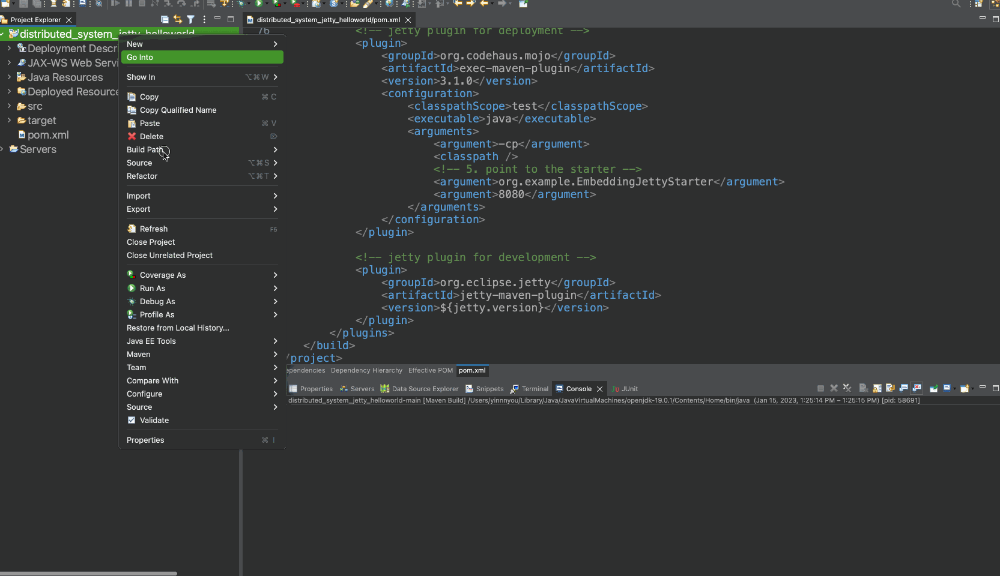
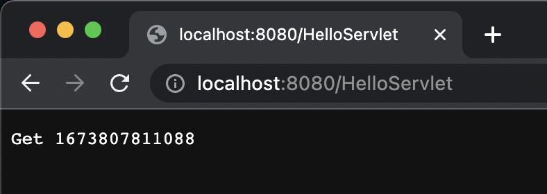

# Building a Cloud-Based Distributed System for Storing and Retrieving Audio Data Using Java and Oracle Cloud Infrastructure

In this project, we developed a distributed software system using Java and Oracle Cloud Infrastructure to store and access audio files with their 
relevant attributes. Our system is thread-safe and uses an executor and concurrent hash map to handle client requests. We have also created an OpenAPI 
specification on SwaggerHub to document the system's endpoints and operations. The system has been deployed on the Oracle Cloud Infrastructure and is 
functioning as intended.

Summary:
Deployed client/server-based distributed architecture using a free-tier cloud virtual machine.

Utilized Jetty, Tomcat, or Spring framework as the server (Java-based Web Servers).

Designed open APIs for GET and POST methods for Audio item resource representation.

Implemented open APIs on SwaggerHub and made them public for accessibility.

Created Audio.java class under the Model package with get() and set() methods for audio item properties.

Programmed a Servlet (ResourceServlet.java) in the Controller package to handle GET and POST requests for Audio resource.

Used an in-memory data structure as storage for audio items, ensuring thread safety.

Maintained a sum of the total number of copies sold for all audio items in the database.

Ensured the server was running on a cloud instance, not localhost.

Implemented a bonus feature: multithreaded the Servlet with a thread pool execution.

Developed AudioClientTest.java to simulate concurrent requests from multiple clients with varying ratios of GET and POST requests.

Recorded round-trip time for each request and plotted a line chart to show the correlation between the number of clients and response time.

Prepared a detailed report with necessary screenshots, including the Swagger API page link.


URL to the project: http://168.138.93.110:9090/coen6731/audio

To test the project, you can use Postman and try accessing the URL.

In addition, an OpenAPI specification has been created using SwaggerHub to document the endpoints and operations of our distributed software system for storing audio items. This standardized documentation helps developers to interact with the system's API. You can access the SwaggerHub link here: https://app.swaggerhub.com/apis/ITSVISHRUTHKHATRI/Audio/1.0.0
https://app.swaggerhub.com/apis/PRANAVJHA/AudioAPI/1.0.2

### Import To Eclipse Java EE Edition

1. Download the zip of this repo and unzip it.

2. Import the project into eclipse as a maven project.

   

3. Config Run for development.

   

4. Config Run for Deployment

   

5. Access servlet.

   

   As you have the servlet at `org.example.controller.HelloServlet.java`.


### CMD

#### To develop the project.

``` bash 
mvn jetty:run
```

> The server config for development is at `pom.xml:86`.
>
> Feel free to configure it.


#### To deploy the project.

``` bash
mvn clean install exec:exec
```
> The server config for deployment is in `org.example.EmbeddingJettyStarter`.
>
> Feel free to configure it.


### Configuration of Jetty

#### Configure in coding

In `org.example.EmbeddingJettyStarter`, you can directly change the port or the context path by:

``` java
Server server = new Server(8080);		// change the port number 
// ...
context.setContextPath("/new_context");   // change the context path
// ...
```

Then you can access the servlet by:

http://localhost:8080/new_context/HelloServlet

At the same time, please make sure your servlet's annotation value mapping is valid for the context path:

``` java
@WebServlet(name = "HelloServlet", value = "HelloServlet")
```

Do not add the root in the front:

``` java
@WebServlet(name = "HelloServlet", value = "/HelloServlet")
```
